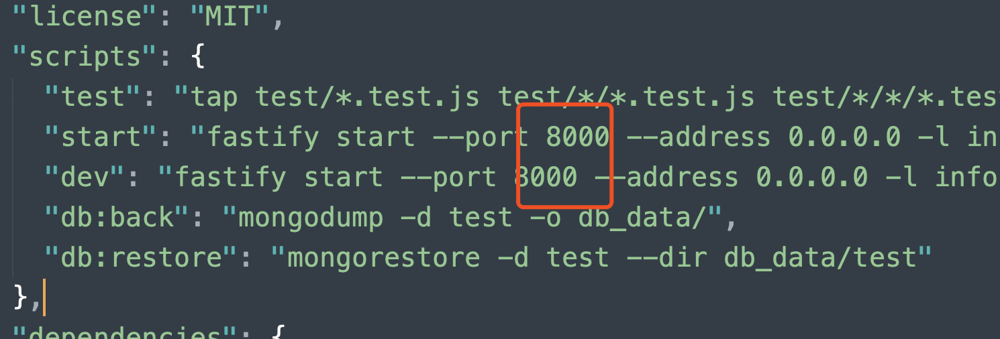

# 十次方 API 接口文档

## 接口部署

### 安装 mongodb

- 下载 mongodb
  + 下载地址：https://www.mongodb.com/download-center/community
- 安装方式
  + [在 Linux 上安装 mongodb](https://docs.mongodb.com/manual/administration/install-on-linux/)
  + [在 macOS 上安装 mongodb](https://docs.mongodb.com/manual/tutorial/install-mongodb-on-os-x/)
  + [在 Windows 上安装 mongodb](https://docs.mongodb.com/manual/tutorial/install-mongodb-on-windows/)
- 安装好以后在终端中执行 `mongod` 命令启动 mongodb 数据库

> 不明白的也可以参考这篇安装配置教程：http://www.runoob.com/mongodb/mongodb-window-install.html

### 安装接口项目依赖

在终端中进入接口项目目录并执行以下命令

```bash
npm install
```

### 启动接口服务

```bash
npm run dev
```

> 注意：
>
> - 启动服务之前务必保证先启动 mongodb 数据库


接口服务默认占用 8000 端口，如果 8000 端口被占用，解决方式如下：

方式一：关闭其他占用 8000 端口的服务

方式二：修改项目中的 `package.json` 文件中的端口号配置（见下图）



---

## 接口说明

### 基准路径

> `http://localhost:8000/api/v1/`

---

## 用户

### 创建用户

> `POST` /users

BODY

```json
{
  "username": "xxx",
  "password": "xxx",
  "nickname": "xxx"
}
```

### 根据用户 id 查询用户信息

> `GET` /users/:userId

### 根据用户名查询用户

> `GET` /users?username=xxx

### 根据昵称查询用户

> `GET` /users?nickname=xxx

### 根据 url_token 查询用户

> `GET` /users/url_token/:xxx

### 更新用户的 urlToken

> `PATCH` /users/:userId/url_token

BODY

```json
{
  "urlToken": "xxx"
}
```

### 更新用户头像

> `PATCH` /users/:userId/avatar

BODY

```json
{
  "file": "xxx",
  "x": "xxx",
  "y": "xxx",
  "width": "xxx",
  "height": "xxx"
}
```

### 用户注册

> `POST` /users/signup

BODY

```json
{
  "email": "xxx",
  "password": "xxx",
  "nickname": "xxx"
}
```

### 用户登录

> `POST` /users/signin

BODY

```json
{
  "email": "xxx",
  "password": "xxx"
}
```

### 更新用户基本信息

> `PATCH` /users/:userId/profile

BODY

```json
{
  "name": "xxx",
  "birthday": "xxx",
  "cellphone": "xxx",
  "location": "xxx",
  "skills": "xxx",
  "gender": "xxx",
  "website": "xxx",
  "bio": "xxx"
}
```

### 更新用户密码

> `PATCH` /users/:userId/password

BODY

```json
{
  "password": "xxx",
  "newPassword": "xxx"
}
```

### 删除用户

> `DELETE` /users/:userId

---

## 问题

### 创建问题

> `POST` /posts

BODY

```json
{
  "title": "xxx",
  "body": "xxx",
  "tags": "xxx",
  "userId": "xxx"
}
```

### 根据问题id获取问题

> `GET` /posts/:postId

### 获取问题列表

> `GET` /posts
>
> 注：默认获取最新发布的问题

PARAMS

- `_page`  页码
- `_limit`   每页大小
- `filter`  筛选条件
  - hot 热门
  - unresponsive 等待回复
- `tags`  标签

### 获取某个用户发布的问题

> `GET` /posts?userId=xxx

### 获取某个用户回复过的问题

> `GET` /users/:userId/comments/questions

### 更新问题

> `PATCH` /posts/:postId

BODY

```json
{
  "title": "xxx",
  "body": "xxx",
  "tags": "xxx"
}
```

### 删除问题

> `DELETE` /posts/:postId

---

## 回复

### 创建回复

> `POST` /comments

BODY

```json
{
  "body": "xxx",
  "userId": "xxx",
  "postId": "xxx" 
}
```


### 获取某个问题的回复数量

> `GET` /comments/count?postId=xxx

### 获取某个问题的所有回复

> `GET` /comments?postId=xxx

### 删除回复

> `DELETE` /comments/:commentId

### 更新回复

> `PATCH` /comments/:commentId

BODY

```json
{
  "body": ""
}
```


---

## 标签

### 获取标签列表

> `GET` /tags

PARAMS

- `_page`  页码
- `_limit`  每页大小


### 获取某个用户关注的标签

> `GET` /tags/followers/:userId

### 根据标签名获取标签

> `GET` /tags/:tagName

### 关注标签

> `POST` /tags/:tagName/followers

BODY

```json
{
  "userId": "xxx"
}
```


---

## 投票

### 查询投票信息

> `GET` /votes

PARAMS

- type
  - 所属类型
- typeId
  - 类型id
- userId
  - 用户id


### 创建投票

> `POST` /votes

BODY

```json
{
  "type": "xxx",
  "typeId": "xxx",
  "value": "xxx",
  "userId": "xxx"
}
```

> 注：
>
> - type 值为 `posts` 或者 `comments`
> - typeId 为 type 类型的 id
> - value 可取的值为 `0`、`1`、`-1`

---

## 用户工作经历

### 创建工作经历

> `POST` /works

BODY

```json
{
  "user": "xxx",
  "company": "xxx",
  "position": "xxx",
  "startDate": "xxx",
  "endDate": "xxx",
  "city": "xxx",
  "skills": "xxx",
  "description": "xxx"
}
```


### 查询某个用户的工作经历

> `GET` `/users/:userId/works`

### 更新工作经历

> `PATCH` /works/:wordId

BODY

```json
{
  "company": "xxx",
  "position": "xxx",
  "startDate": "xxx",
  "endDate": "xxx",
  "city": "xxx",
  "skills": "xxx",
  "description": "xxx"
}
```


### 删除工作经历

> `DELETE` /works/:workId

## 公共

### 文件上传

> `POST` /upload


